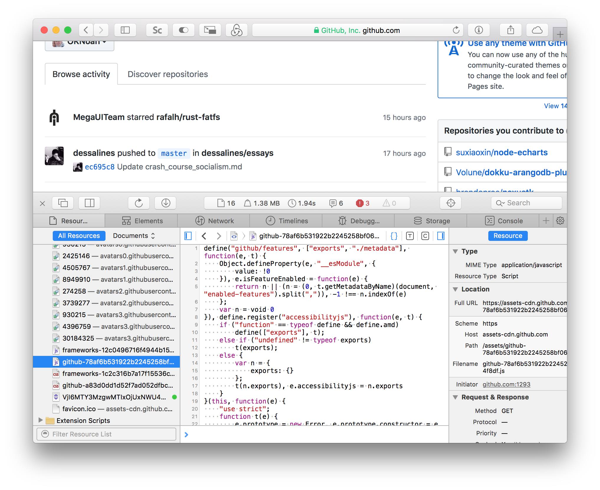
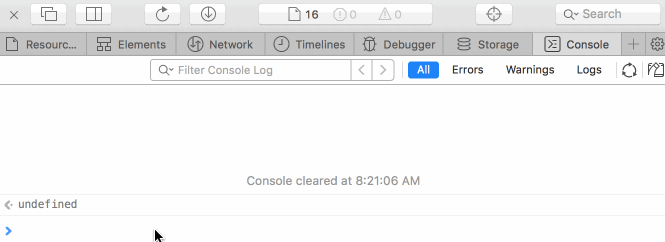

# Reading Javascript

There are many resources for reading examples of Javascript, and it's a quick way to learn. But you can't start reading example or tutorials until you can make sense what's written there. We'll start with the basics of understanding what different puncuation marks represent in Javascript.

## Quotes (strings)

```javascript
"Hello world" // Double-quotes
'Hello world' // Single-quotes
`Hello world` // Back-ticks
```

Anything inside quotes is a **"string"**, aka text or characters. Characters are anything like "a, b, c", "1, 2, 3" or "🤗, 🇰🇵, ".

> Javascript has a few different types of quotation marks. Those are single-quotes `'`, double-quotes `"` and back-ticks (which are difficult to show on this website, but they are on the same keyboard key as the `~`). They all do the same thing, mostly.

## Numbers (integers)

```js
123 // A regular number, aka an integer
1.23 // Number with decimal place, aka a "float" or "floating point" number
-123 // A negative number
```

Keep in mind that `"123"` (a string) and `123` (a number) are not the same thing. Don't put your numbers in quotes if you plan to use them as numbers (such as sorting them or doing math with them). In the rare case you have a user _named_ 11, then go ahead and use quotes.

## Brackets (arrays)

```js
["This", "array", "has", 4, "values"] // Arrays hold a list of items of any kind
["Arrays", ["can", "even", ["hold", "arrays"]]]
```

When you see brackets (`[ ]`), the contents is a comma-seperated list of whatever you like. NOTE: That's not really a typo up there where I said the array has 4 values. Humans count 5 values, but computers usually start at 0. The 0 value in that top array is "this", and the 4th is "values". Of course, you can say it has 5 values if you must communicate to humans.

## "const" and "let" (variables)

```js
const name = "Joe" // this takes the string "Joe" and stores it as `name`
let age = 25 // this stores 25 in `age`
const let = "You can't do this" // `let` is a reserved word
```

Javascript has many "keywords", like `const`, `let`, `return` and `import`. These are built-in devices that tell Javascript what to do. For things that aren't built-in, we usually want to assign them a keyword of their own, AKA a variable. `const` lets us make variables that won't change, and `let` is used to make variables that will change. (Some Javascript still uses something called `var`, but we won't use that. It's like `let`.)

## True and false (boolean)

```js
let isLoggedIn = false // this makes a variable called `isLoggedIn` which is not true
const communismWillWin = true // ;)
```

Sometimes we only want to represent 1 of 2 values. In this case we can just say `true` or `false`. Notice there are no quotation marks around these words. If we said `"false"` this would technically just be a string.

## Curely-brackets (objects)

```js
const user = {  // This also demonstrates the variables idea above
  name: 'Joe',
  age: 25,
  hobbies: ['revolution', 'naruto']
}

user.name // this will equal `"Joe"`
user['age'] // this will equal `25`
user.hobbies[1] // this will equal `"naruto"`
```

This is where things all come together. An object can hold many values -- strings, numbers, arrays, other objects, etc -- and assigns each value to a "key" (such as `name` or `age` in the example above).

We can retrieve this our values using the key in 2 ways; by using the dot syntax (`myObjectVariable.myKey`) or using the bracket syntax (`myObjectVariable['myKey']`). In fact, arrays use the bracket syntax as well, but inside the brackets we put numbers, starting at 0.

## Parenthesis (functions)

```js
function getUser () {
  // this creates a variable `getUser` that executes code inside the curly brackets
}
const getUser = (args) => {
  // this does the same thing, but the function accepts a variable we've named "args"
}

getUser(123) // this executes the function, and passes in the number 123
```

If you've ever used spreadsheets like Excel, you've probably used functions (and variables). You can think of functions and arguments like the `SUM(123, 456, 11)` function in spreadsheets. It has a variable, `SUM`, and accepts arguments in parenthesis, `123, 456 and 11`.

## Conclusion

```js
const user = {
  name: 'Joe',
  age: 25,
  sayHello: function (friend) => {
    console.log('Hello, ' + friend + '. I'm ' + this.name + '.')
  }
}

user.sayHello('Rose') // this outputs "Hello, Rose. I'm Joe."!
```

As you can see, objects are very powerful. We can store all the information we need to about an entity, and even store functions that let us reference the object itself (`this.name`).

Objects are so important in Javascript that, in fact, everything is an object. Strings, numbers, arrays, functions, they're all actually objects. We can do things like `"space+bar+broken".replace('+', ' ')`; the `.` there is the same dot syntax we use to get values from an object, and in this case it's executing a function called `replace`, which will replace `"+"` with a space.

Javascript objects have another name: "JSON". This stands for JavaScript Object Notation, and it's also often used in communicating information over the web. We'll be seeing lots of JSON in the next lesson.

# Exercises

## 1. Codecademy (recommended)

A great, quick and interactive crash course in Javascript syntax can be found on Codecademy.com.

## 2. Github (extra)

Github is the most popular place for storing open source code and projects. We'll learn more abou it later. But for now you can peruse Github for interesting projects and practice reading the code with the knowledge from this lesson. Just go to `https://github.com` and use the search function, then filter the results to include only Javascript projects.

## 3. NPM (extra)

Does all this look kind of intimidating so far? Here's an asuring secret: Javascript is largely an exercise in piecing together other projects and using other people's work. NPM is a tool used to easily import and share these tools. You can get a sense of just how much work is already done for you by going over to https://npmjs.org and searching for just about anything. Search for "pinterest" to see that there are easy tools for working with Pinterest. For example, there might be a function that lets you simply do `const pin = getRandomPinterest()`!

## 4. Console (extra)

**In Safari**: Press `command + ,` to open Preferences. Click the Advanced tab and at the bottom check the box "Show Develop menu in menu bar". [This screenshot should help.](assets/lesson1_safari_setup.png) Now we can press `command + alt + i` to open "Web Inspector". Or go to `Developer > Show Web Inspector` [like this](assets/lesson1_safari_developer_menu.png).

**In Chrome**: Just press `command + alt + i`. In Windows this is probably `control + alt + i`.



Forget about any ugly code you see if you explore files here. Developers use tools to make their code smaller and more compatible. When they write the code, it's a lot easier to understand.

Head over to the "console" part if you're not there already. At the very bottom is an area you can type in; look for a `>` marker. Here you can freely type is javascript and see the output, or alter the webpage, once we learn how.

Let's type `console.log('hello')` in there and press enter.


